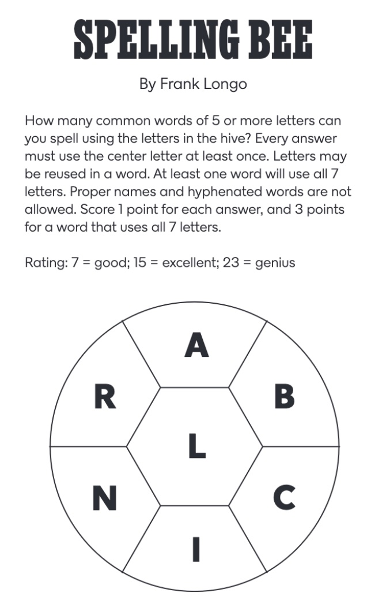

This GitHub repository is for you to work on UNC CS301 Assignment 1.
The problems for you to work on are below.  You should work on them in the
scrabble.py file, found also in this directory.  You will submit your 
work by committing this file back to your Github repository.  Each time
you commit it, it will be autograded, and you can see the results in the 
"Actions" tab.  You can resubmit as many times as you'd like prior to
the submission deadline.  You can also run the tests yourself without
submitting by running the file invoketests.py.  You will very likely
find it helpful to supplement these with your own tests as well.
You can add additional testing code to the scrabble.py file, or you
can create your own testing file.  Don't modify the test_Pn.py files.

If we're going to think about algorithms and data structures to solve
problems ...

...we're going to need some problems!

Try to solve these problems by writing Python functions. Come up with as
many different ways as possible to solve each problem. We have several
goals in mind here: to start thinking about different kinds of
algorithms and data structures and their pros and cons, and, more
generally, to try to remember how Python works.

Some problems could be mathematical:

1.  What is the sum of the first $n$ positive integers?

Others could come from real life. Perhaps you like to play scrabble?

Useful for these problems: the file
words.txt contains most words in the English language. The 
stencil for this assignment includes code to read these words into
one big Python list.

2.  Given a proposed word that someone wants to play, can you check that
    it is a valid word?

3.  Given a set of tiles and a word, can you check if the word can be
    made from the tiles?

4.  Even more useful: given a set of tiles, can you find all the words
    you can make with them, using all of the tiles? For example, if you have the tiles in the
    word "retains\", you could also rearrange them to spell "anestri,"
    "nastier," "ratines," "retains," "retinas," "retsina," "stainer,"
    and "stearin."

5.  The *New York Times Sunday Magazine* publishes a related puzzle
    called the Spelling Bee each week.  An example is reproduced below.
    Can you write a function to tell you all of the
    possible words for a given puzzle?

7.  In Scrabble, a \"bingo\" is when you play all seven tiles in your
    rack, along with an eighth letter on the board, to form an eight
    letter word. What set(s) of eight letters forms the most possible
    bingos?

Remember that, in addition to being able to chose different algorithms
to solve these problems, you could also chose different data structures
to represent your data, and that these could also make a difference.

Ok, one last thing to think about: if we have several different ways to
solve the same problem, how can we decide which ones are "better"??

   
    

